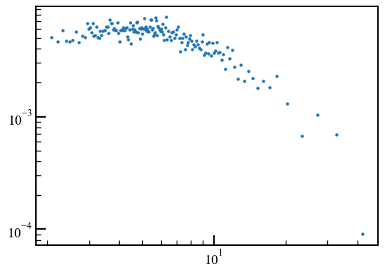
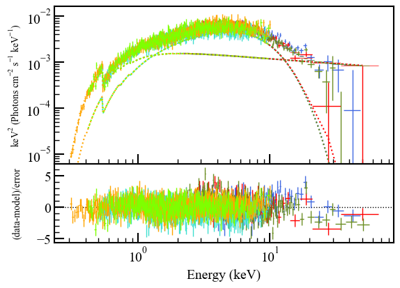
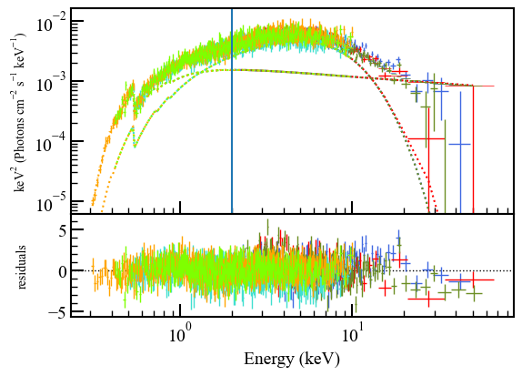
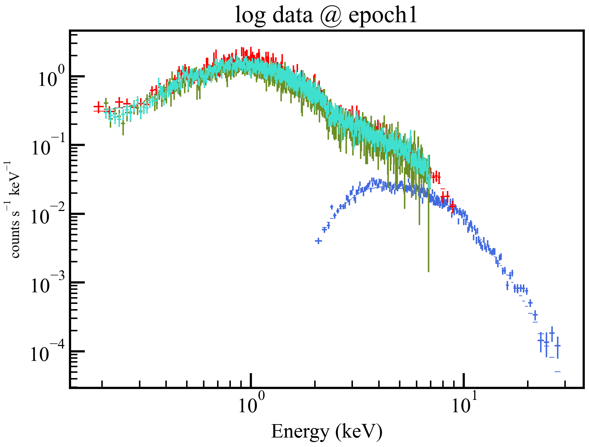
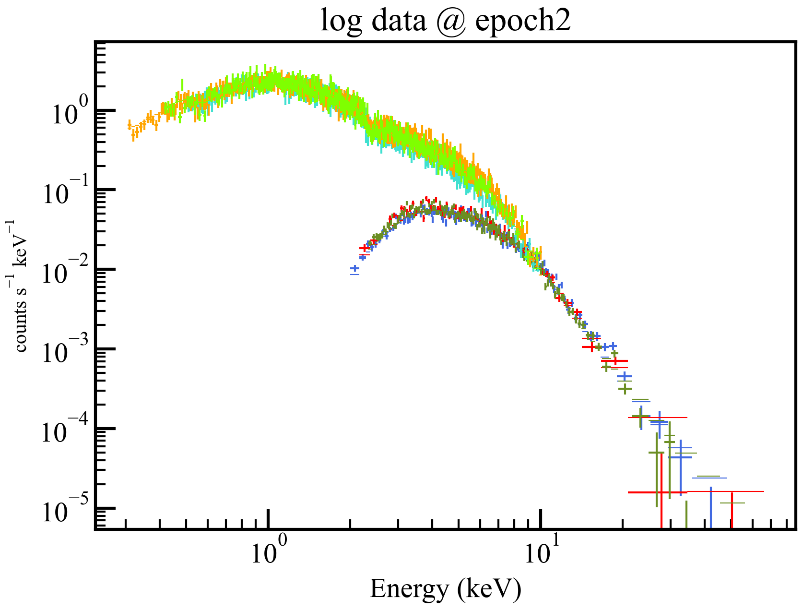

# yt_pyXspecを利用した効率化

## xcmファイルの読み込み (共通項目)

まずは必要なlibraryを読み込む。

```python
# import
import os
import re
import matplotlib.pyplot as plt
import yt_pyXspec
```

続いて、class `Ytpx`を生成する。
その際、引数`dir_path`として作業フォルダ(xspec用のfitフォルダなど)を与える。

```python
## dir_path: 作業フォルダ
dir_path = os.environ["HOME"]+"/XXXXXXXXX/fit"
ytpx = yt_pyXspec.Ytpx(dir_path=dir_path)

# > change directory to /home/USER_NAME/XXXXXXXXXXXXXX/fit
```

`ytpx`生成時に作業フォルダ内の`.xcm`ファイルの検索結果が`ytpx.xcms`にlistとして収められているが、
これでは含まれるファイル数が多すぎるかもしれない。
その場合は`ytpx.findXcm(keyword, dir_path)`で検索する。
`dir_path`を省略した場合、`ytpx`生成時に与えた`dir_path`が使用され、
`keyword`が省略された場合`*.xcm`が使用される。
なお、挙動としては`glob2.glob(dir_path+"/"+keyword)`と同じであり、
この結果が返されつつ`ytpx.xcms`に収められる。

```python
ytpx.findXcm(keyword="all_*.xcm")

# ----- ytpx.xcms -----

["/home/USER_NAME/XXXXXXXX/fit/all_epoch1.xcm",
  "/home/USER_NAME/XXXXXXXX/fit/all_epoch2.xcm"]
```

そして`ytpx.loadXcm(xcm_path)`にxcmファイルのpathを与えることでxcmファイルが読み込まれる。
一部の関数を使用する場合を除き、この`ytpx.loadXcm()`を(forループの中などで)多く利用することになる。

```python
xcm_path = ytpx.xcms[0]
ytpx.loadXcm(xcm_path=xcm_path)
# > Default fit statistic is set to: Chi-Squared
# >  This will apply to all current and newly loaded spectra.
# > .......
# > .......
# >  Current data and model not fit yet.
```

## グラフをplotする

グラフのplotなどは以下の関数(`ytpx`のmethod)などで実行できる。

|関数名|主な機能|
|-|-|
|`obtain_datass()`|pyXspecに読み込まれているデータでplotを実行したグラフのデータ点(`datass`)を返す|
|`plot_datass()`| pyXspecに読み込まれているデータでplotを実行した結果 (あるいは入力された`obtain_datass()`の出力`datass`) を`plt`(`matplotlib.pyplot`)でプロットした結果を表示し、`fig`(`plt.Figure`)および`axs`(`[plt.AxesSubplot, ...]`)を返す。引数に応じてグラフが画像やfitsファイルに保存される。|
|`plot_datass_fromXcms()`|引数`xcms`にlistとして与えられたxcmファイルを関数内で順に読み込み、グラフを生成し、指定された名前で画像やfitsファイルに保存する。|

### obtain_datass

`ytpx.obtain_datass()`でデータ点を取得できる。

```python

xcm_path = ytpx.xcms[1]
ytpx.loadXcm(xcm_path=xcm_path)

datass = ytpx.obtain_datass(["eeu", "del"])

# > ***Warning: Fit is not current.

# ---- datass -----

{"eeu": { # plot type
    "info": {
        "labels": {
            "x": "Energy (keV)",
            "y": "keV$\\mathdefault{^{2}}$ (Photons cm$\\mathdefault{^{-2}}$ s$\\mathdefault{^{-1}}$ keV$\\mathdefault{^{-1}}$)"},
        "title":"Unfolded Spectrum",
        "log": {"x": True, "y": False},
        "model": "phabs(powerlaw + diskbb)",
        "plotWindow": 1,
        "xcm_fileName": "/home/tomo_nec/hea/work/tutorial_holmbergIX_X1/fit/all_epoch2.xcm"},
    "data": {
        1: { # plotGroup = Data Group Number
            "src_fileName": "A+B_30002033006_grp100.pha",
            "xs": [2.0800000429153442,
                    2.2200000286102295,...],
            "ys":[...],
            "xe":[...],
            "ye":[...],
            "ys_model":[...],
            "ys_comps":[[...],[...]],
            "compNames":["powerlaw", "diskbb"]},
            2:{...},
            ...,
            6:{...}}
    },
    "del":{...}
}

```

additive componentsが1つだけの場合、`ys_comps`および`compNames`は(xspecの仕様に従い)省略される。
また、plotするtypeがdelやratioの場合、データ点のみがplotされるので、`yd_model`、`ys_comps`および`compNames`は省略される。

これをmatplotlibに渡すことで、適当なグラフのplotもできる。

```python
xs = datass["eeu"]["data"][1]["xs"]
ys = datass["eeu"]["data"][1]["ys"]
plt.xscale("log")
plt.yscale("log")
plt.scatter(xs, ys, s=5)

#plt.savefig(os.environ["HOME"]+"/work/tmp/plt_plot_eeu.png", bbox_inches="tight")
```



### plot_datass

`ytpx.plot_datass()`でデータ点をmatplotlibでplotする。
グラフの見た目はxspecに寄せられている。
オプションで画像などとしての出力、タイトルラベルの設定もできる。

```python
fig, axs=ytpx.plot_datass(["eeu", "del"])
#, exportImagePath=os.environ["HOME"]+"/work/tmp/ytpx_plot_eeu-del.png"
```



また、`fig`(`plt.Figure`)および`axs`(`[plt.AxesSubplot, ...]`)を返すので、それを追加で編集することができる。


```python
axs[1].set_ylabel("residuals")
axs[0].axvline(x=2.0)
# fig.savefig(os.environ["HOME"]+"/work/tmp/ytpx_plot_eeu-del_edit.png")
fig
```



### plot_datass_fromXcms

`ytpx.plot_datass_fromXcms()`で複数のxcmファイルを読み込んで、matplotlibでplotしていく。

```python
# ----- ytpx.xcms -----

["/home/USER_NAME/XXXXXXXX/fit/all_epoch1.xcm",
  "/home/USER_NAME/XXXXXXXX/fit/all_epoch2.xcm"]

# import re, os

def title_func(xcm_path):
    str_fromXcm=re.sub(r"^all_|\.xcm$" ,"", os.path.basename(xcm_path))
    return f"log data @ {str_fromXcm}"

def exportImagePath_func(xcm_path):
    dir_path="/YYYYYYYYYYYYYYY/imgs"
    str_fromXcm=re.sub(r"^all_|\.xcm$" ,"", os.path.basename(xcm_path))
    return f"{dir_path}/ld_{str_fromXcm}.png"

fig_subplots_dict = ytpx.plot_datass_fromXcms(
    xcms=ytpx.xcms,
    plots=["ld"],
    title_func=title_func,
    exportImagePath_func=exportImagePath_func
)
# ------- output ----- 
"""
***Warning: The file sent to Xset.restore(): /home/XXXXXXXXXXXXXX/fit/all_epoch1.xcm
    is not detected to be a file generated from Xset.save().
    Xset.restore() usage is only intended for Xset.save() output.
    General XSPEC/Tcl scripts may not fully execute in PyXspec.


***Warning: Fit is not current.

***XSPEC Error: Requested array does not exist for this plot.

***XSPEC Error: Requested array does not exist for this plot.

***XSPEC Error: Requested array does not exist for this plot.

***XSPEC Error: Requested array does not exist for this plot.
Figure is saved as /home/YYYYYYYYYYYY/ld_epoch1.png

***Warning: The file sent to Xset.restore(): /home/XXXXXXXXXXXXXXX/fit/all_epoch2.xcm
    is not detected to be a file generated from Xset.save().
    Xset.restore() usage is only intended for Xset.save() output.
    General XSPEC/Tcl scripts may not fully execute in PyXspec.


***Warning: Fit is not current.

***XSPEC Error: Requested array does not exist for this plot.

***XSPEC Error: Requested array does not exist for this plot.

***XSPEC Error: Requested array does not exist for this plot.

***XSPEC Error: Requested array does not exist for this plot.

***XSPEC Error: Requested array does not exist for this plot.

***XSPEC Error: Requested array does not exist for this plot.
Figure is saved as /home/YYYYYYYYYYYYY/ld_epoch2.png
"""
```




